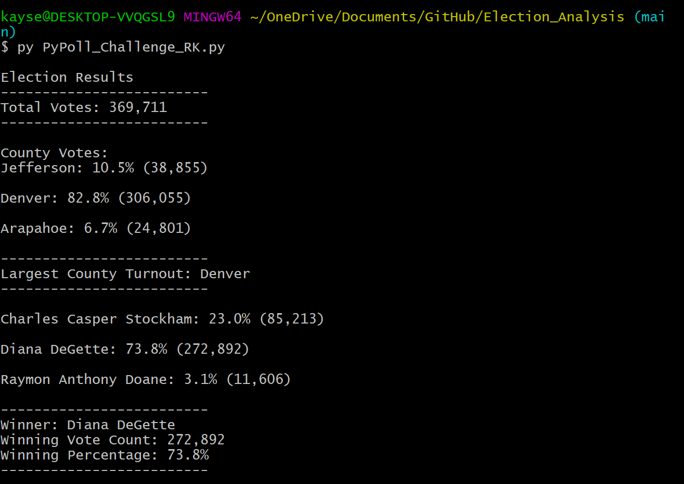

# An Analysis of the Election Results of a Colorado Precinct
 

## Table of Contents
* [PyPoll Overview](https://github.com/rkaysen63/Election_Analysis/blob/main/README.md#pypoll-overview)
* [Resources](https://github.com/rkaysen63/Election_Analysis/blob/master/README.md#resources)
* [Summary](https://github.com/rkaysen63/Election_Analysis/blob/master/README.md#summary)
* [PyPoll Challenge Overview](https://github.com/rkaysen63/Election_Analysis/blob/master/README.md#PyPoll-Challenge-Overview)
* [Challenge Resources](https://github.com/rkaysen63/Election_Analysis/blob/master/README.md#challenge-resources)
* [Election Results](https://github.com/rkaysen63/Election_Analysis/blob/master/README.md#election-results)
* [Election Audit Summary](https://github.com/rkaysen63/Election_Analysis/blob/master/README.md#Election-Audit-Summary)

## PyPoll Overview
The Colorado Election Commission has requested assistance with an audit of the tabulated votes for a precinct in Colorado.  They have requested a report of the election results that include the total number of votes cast, the total number of votes for each candidate, the percentage of votes for each candidate, and winner based on the popular vote.

This analysis is the precursor to the challenge assignment and was performed while learning the basics of the Python coding language. 

## Resources
Data Source:    
Software:  Python 3.8.5 
Lesson Plan:  UTA-VIRT-DATA-PT-02-2021-U-B-TTH, Module 3

## Summary
* The Colorado precinct that was analyzed includes the following counties:
  * Arapahoe
  * Denver
  * Jefferson

* The candidates were:
  * Diana DeGette
  * Raymon Anthony Doane
  * Charles Casper Stockham

* The analysis of the election shows that of the total votes cast:
  * Diana DeGette received 73.8% of the vote (272,892 votes).
  * Raymon Anthony Doane received 3.1% of the vote (11,606 votes).
  * Charles Casper Stockham received 23.0% of the vote (85,213 votes).
 
* The winner of the election was:
  * Diana DeGette, who received 73.8% of the popular vote and 272,892 number of votes.

## PyPoll Challenge Overview
The Colorado Election Commission has requested assistance with an audit of the tabulated votes for a precinct in Colorado.  They have requested a report of the election results that include the total number of votes cast, the total number of votes for each candidate, the percentage of votes for each candidate, and winner based on the popular vote. In addition, they have also requested the voter turnout for each county, the percentage of votes from each county out of the total count, and to identify the county with the highest turnout.

The data was analyzed by a program written in the Python coding language. os and csv modules were imported because these modules have useful re-usable "pre-packaged" code or functions that eliminate the need to write the code necessary to perform those functions. In this exercise, I used `csv.reader` to read the csv file and used the `os.path.join` function to locate the desired data file and also to save and name the text file to a designated location.  I created a number of variables that included integers, lists, dictionaries, and strings.  These were initialized to zero or empty, i.e. `= 0`, `= []`, `= {}`, `=""`. Using a `with` statement I opened the csv file as `election_data` and used `csv.reader()` function to read the csv file in order to cycle through each row of the data.  The header row was removed from the data with the `next()` function.

Then a `for` loop was set up to iterate through the data, row by row, to obtain the candidates' and counties' names and count the votes and voters, respectively, for each by increasing the total vote for each candidate as his/her name appeared in the data and similarly increasing the total number of voters for each county as the county name appeared in the list.  In otherwords, the total vote for the candidate was the number of times that candidate's name appeared in the list.  The total number of voters for a county was the total number of times the county appeared in the list.  Within the `for` loop, two `if` statements were written.  The first `if` statement used a `not in` membership operator.  If the candidate's name, `candidate_name`, was not in the candidate list, `candidate_options`, then the following occurred: the candidate's name was added to the list `candidate_options.append(candidate_name)`, identified the key `candidate_name` in the library `candidate_votes{}`, and initialized the candidate's vote count to zero.  The second `if` statement was also used a `not in` membership operator to perform the same function for the counties. `if county_name not in county_list:` then `county_list.append(county_name)`; `county_votes[county_name] = 0`.  Once the candidate or county was added to their respective lists, the vote count (voter count) was increased when that candidate or county name appeared in the list.

A `with` statement was used to open the file to save and write to it `with open(file_to_save, "w") as txt_file:`.  An `election_results` variable was created containing an f-string combining text and {total votes:,} that was used to print the total votes to the terminal `print(election_results, end="")` and write the total votes to the text file `txt_file.write(election_results)`.  A `for` loop was set up retrieve each county's voter count, calculate the percentage of voters per county, print the county results and write the county results to a text file.  The percentage of voters = county vote count divided by the total number of voters times 100.  Within this `for` loop there is an `if` statement to determine the county with the largest voter turnout. `if (votesCo > county_voter_turnout):` then `largest_county = county_name` and `county_voter_turnout = votesCo`.  After the `for` loop is completed, then the `largest-county_summary` was created with an f-string and the `{largest_county}` name to print and write in the analysis.

Finally, another `for` loop with an `if` statement similar to the `for` loop for the county results was set up for the candidates results.

## Challenge Resources
Data Source:    
Software:  Python 3.8.5 
Lesson Plan:  UTA-VIRT-DATA-PT-02-2021-U-B-TTH, Module 3

## Election Results
* The Colorado precinct that was analyzed includes the following counties:
  * Arapahoe
  * Denver
  * Jefferson
  
* The candidates were:
  * Diana DeGette
  * Raymon Anthony Doane
  * Charles Casper Stockham

* Total number of votes cast: 369,711

* The analysis of the election shows that of the total votes cast:
  * Diana DeGette received 73.8% of the vote (272,892 votes).
  * Raymon Anthony Doane received 3.1% of the vote (11,606 votes).
  * Charles Casper Stockham received 23.0% of the vote (85,213 votes).

* The winner of the election was:
  * Diana DeGette, who received 73.8% of the popular vote (272,892 votes).

* The results show that of the three counties in the precinct, Denver County had the largest turnout with 272,892 voters.

* The voter turnout by county is as follows:
  * Arapahoe County had 24,801 voters turn out to vote, equating to 6.7% of the precinct's total number of voters.
  * Denver County had 306,055 voters turned out to vote, equating  to 82.8% of the precinct's total number of voters.
  * Jefferson County had 38,855 voters turn out to vote, equating  to 10.5% of the precinct's total number of voters.

The results were written to a text file, , and printed to the terminal, 

## Election Audit Summary

The results were gathered from data saved in a csv (comma separated value) file using a program written in Python.  This program may be used to analyze election data from other precincts or districts with very little modification because the code is fairly generic.  There are two exceptions: 1. the path to retrieve the data and 2. the path to store the output text file.  The method to make these minor changes is described below.

In order to use the program for other precincts:
1. Update the `file_to_load =` path in order to retrieve a new data file.
   * Per line 9 of PyPoll_Challenge_RK.py code:
   * The current file path to retrieve the data is: `file_to_load = os.path.join("Resources", "election_results.csv")`
   * Change the path to reflect the actual location of the new code.  This may be done in two ways: either replace the path within the parentheses, or replace the code `os.path.join` with the direct path of the file.  
   * To illustrate, please consider the following example file, folder and folder location relative to the program:
     * File name: district1_election_results.csv
     * Folder name:  all_districts
     * Location of folder "all_districts" is up a level in the folder structure from the analysis program.
   * File Path Example 1, uses `os.path.join`, but replaces the particulars of the path within the parentheses as follows:
     * `file_to_load = os.path.join("..", "all_districts", "district1_election_results.csv")`
     * The new path indicates to the program to go up a level in the folder structure, select the "all_districts" folder and select "district1_election_results.csv" file from that folder.
   * File Path Example 2, uses the direct path method.
     * On line 9 of the code, delete everything after `file_to_load =`
     * Then, navigate to the desired file in Windows File Explorer.
     * Then, click once on the file.
     * While the file is selected/highlighted, press the shift key and right click on the file for the drop-down menu.  From the drop-down menu select "copy as path".
     * Paste the path after the equal sign on line 9 of the code.  It should look something like this: `file_to_load = "C:\Users\<user_name>\Documents\all_districts\district1_election_results.csv"`.
     * Then add a second forward slash to each forward slash so that it looks like this: `file_to_load = "C:\\<user_name>\\Documents\\all_districts\\district1_election_results.csv"`.
2. Change the `file_to_save =` path in order to save the new results in the desired folder and create a new text file name in order to prevent saving over the existing text file.  
   * Per line 11 of the PyPoll_Challenge_RK.py code:
   * The current file path to save the text file with the results is: `file_to_save = os.path.join("analysis", "election_results.txt")` 
   * Change the prefix of the .txt file to a new name. If you want to save it in the same folder as "election_results.txt" you do not need to change the folder, "analysis."  If you want to store it elsewhere, then you will have to give the program directions to find the new folder, using the procedure described in the File Path Examples 1.1 or 1.2 above.
   * For example, for district1_election_results.csv data, name the output file and "join" it to the folder location.  In this example, the new file will be called "district1_results.txt" and it will be saved into the same folder, "analysis", as "election_results.txt".
   * `file_to_save = os.path.join("analysis", "district1_results.txt")` 
   * The new file "district1_results.txt" will be created when the code is executed and placed in the "analysis" folder, which in this case is located in the same folder with the PyPoll_Challenge_RK.py program.  Therefore, there is no need to go up a level or two or into another folder.

